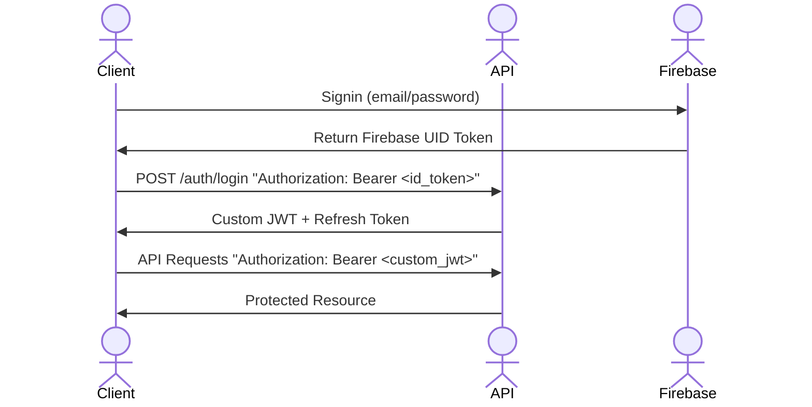

# API Design

## Overview
Establishing rules and patterns that the overall project will adhere to ensuring consistency.

## RESTful Conventions
### Resource Naming
All resources use **plural nouns** in URLs, even for single-item operations.

**Correct:**
- `/users` - Collection of users
- `/users/:id` - Single user
- `/plans` - Collection of plans
- `/plans/:id/attendees` - Nested collection

**Incorrect:**
- `/user` - Don't use singular
- `/getUser/:id` - Don't use verbs in resource names
- `/users/:id/getPlans` - Don't use verbs in paths

### HTTP Verbs
Use the standard HTTP verbs for indicating the action being made:

| Verb | Purpose | Example |
|------|---------|---------|
| `GET` | Retrieve resource(s) | `GET /plans` - List all plans |
| `POST` | Create new resource | `POST /plans` - Create a plan |
| `PATCH` | Partial update | `PATCH /plans/:id` - Update plan fields |
| `PUT` | Full replacement | `PUT /plans/:id` - Replace entire plan |
| `DELETE` | Remove resource | `DELETE /plans/:id` - Delete a plan |

**Best Practices:**
- Use `PATCH` for partial updates
- Use `PUT` only when replacing the entire resource
- `POST` to collections creates new items
- `POST` to a specific resource performs actions (see Custom Actions below)

### URL Structure
**Pattern:** `/{resourece}/{id}/{sub-resource}/{id}`

**Examples**
```http
# Users
POST /users # Create new user
GET /users/:id # Get user profile
PATCH /users/:id # Update part of user profile
DELETE /users/:id # Delete user profile

# Nested Resource (Plan attendees)
GET /plans/:id/attendees # List plan attendees
POST /plans/:id/attendees # Join a plan
DELETE /plans/:id/attendees/:userId # Remove an attendee

# Notifications
GET /users/:id/notifications # Get all notifications for user
PATCH /users/:id/notifications/:notificationId/read # Mark notification as read
```

### Custom Actions
Actions that don't fit the regular CRUD operations. Use `POST` to a descriptive endpoint:
**Pattern** `POST /{resource}/{id}/{action}`

**Examples**
```http
# Plan actions
POST /plans/:id/join # Join a plan
POST /plans/:id/check-in # QR code check in

# User actions
POST /users/:id/block # Block a user
POST /users/:id/follow # Follow a user

# Subscriptions
POST /subscriptions/portal # Get customer portal URL
```

**Rationale:**
- These are **RPC-style** operations that don't map cleanly to resource updates as RPC is more action focused, rather than entity oriented
- Using `POST` makes it clear these are actions, not just data updates
- Action names use verbs (join, leave, block) since they're operations, not resources

### Query Parameters
Use query parameters for filtering, sorting and pagination:

**Filtering**
```http
GET /plans?interests=bouldering,coffee # Names of activities
GET /plans?distance=5&lat=34.05&lng=-118.24 # Location based filtering
GET /plans?startTimeAfter=2024-02-15T00:00:00z # Time based filtering
GET /plans?status=visible # Visibility based filtering
```

**Sorting**
```http
GET /plans?sort=startTime # Default ascending
GET /plans?sort=-startTime # Descending using minus prefix
GET /plans?sort=distance,startTime # Multiple fields
```

**Pagination**
```http
GET /plans?limit=20&cursor=djnASdNJJN # Cursor-based (preference for feeds)
GET /reports?limit=50&offset=100 # Offset based
```

**Search**
```http
GET /plans?q=coffee # Free text search in title/description
```

## Authentication
Using **JSON Web Token (JWT) bearer tokens** to handle API authentication.

### Authentication Flow


**Auth Flow** (The "BFF" Pattern)
1. The user logs in via Google/Email. Firebase returns an ID Token to the frontend.

2. The frontend immediately sends that ID Token to the backend (/auth/login).

3. The backend verifies the Firebase ID Token. If valid, the backend generates two things of its own:

    - Custom JWT (Access Token): Sent in the JSON body (stored in JS Memory).
    - Refresh Token: Sent in a Set-Cookie header with the HttpOnly and Secure flags.

4. Cookies is holding the 7-day key, and JavaScript is holding the 15-minute key.

### Token Types
Different tokens are used for specific purposes, ensuring higher level of security.

**Firebase ID Token**
- When user logs in (via Google, email etc) Firebase returns the ID Token back.
- Client sends to /auth/login with the firebase ID.
- Proves to the backend that the user has successfully authenticated.
- 1 hour life cycle.
- Used to switch out for the Custom JWT.

**Custom JWT**
- Acts as the access token, sent in `Authorization: Bearer <token>` header on every request.
- Returned by the backend once /auth/login has been hit.
- Used for validation on backend requests.
- Expires after 15 minutes for high security resets.
- Once expired, API returns `401 Unauthorized`.
- Stored in memory, rather than localstorage/cookies to ensure no XSS (Cross-site scripting) attacks.
- Refreshed by the /refresh endpoint via the Refresh Token.

**Refresh Token**
- When 15 minute window for Custom JWT has expired, Refresh Token is sent to /refresh to retrieve a fresh Custom JWT.
- Stored as HttpOnly Cookie as critical security as this stops any scripts running and reading the cookie.
- 7 day life as it doesn't keep a user logged in for longer than a week.

### Bearer Tokens
All authentication requests must include the JWT in the `Authorization` header.

```http 
GET /plans Authorization: Bearer eyASDLJNASDNJKD
```

### Token Payload
The JWT contains the following payload claims:

```json
{
  "sub": "usr_123",
  "email": "test@email.com",
  "role": "user",
  "tier": "premium",
  "emailVerified": true,
  "iat": 17092323,
  "exp": 17092343
}
```

- `sub`: User ref (subject)
- `email`: Users email address
- `role`: Role of the user "user | moderator | admin"
- `tier`: Subscription level "free | premium"
- `emailVerified`: If email has been verified
- `iat`: Issued at (Unix timestamp)
- `exp`: Expiration (Unix timestamp)

### Authorization Levels

Different endpoints require different authorization levels:

| Level | Description | Example Endpoints |
|-------|-------------|-------------------|
| **Public** | No authentication required | `GET /plans` (browse), `GET /plans/:id` (view) |
| **Authenticated** | Valid JWT required | `POST /plans` (create), `POST /plans/:id/join` |
| **Email Verified** | JWT + `emailVerified: true` | `POST /plans/:id/messages` (chat) |
| **Host Only** | JWT + user is plan host | `PATCH /plans/:id`, `DELETE /plans/:id` |
| **Premium Only** | JWT + `tier: 'premium'` | `POST /plans` (with `accessLevel: 'premium'`) |
| **Moderator** | JWT + `role: 'moderator'` | `GET /reports`, `PATCH /reports/:id` |
| **Admin** | JWT + `role: 'admin'` | `PATCH /users/:id/ban`, `GET /admin/*` |

### Security Considerations
**Token Storage (Client)**
- Store access token (Custom JWT) in memory (Zustand)
- Store refresh token in HttpOnly cookie
- Never store tokens in plain localStorage due to risk of XSS vulnerability

**Token Rotation**
- Refresh tokens are single-use and each refresh returns a new refresh token
- Old refresh tokens are invalidated immediately after use
- Prevents token replay attacks

**Rate Limiting**
- Login attempts: 5 per IP per 15 minutes
- Refresh token: 10 per user per hour
- Registration: 3 per IP per hour

**Password Requirements**
- Minimum 8 characters
- At least one uppercase
- At least one lowercase
- At least one number
- Hashed with Argon2

## Authorization
Using various authorization patterns to ensure control access to particular resources and actions.

### Role-Based Access Control (RBAC)
Users are assigned a role which has rules associated with them

**Roles**
| Role | Description | System Access |
|------|-------------|---------------|
| `user` | Standard user | Create plans, join plans, send messages, file reports |
| `moderator` | Content moderator | All user permissions + view/resolve reports, hide content, view moderation decisions |
| `admin` | System administrator | All moderator permissions + ban users, manage feature flags, view audit logs |

**Role Hierarchy**
Higher roles inherit all permissions from lower roles.
`admin` > `moderator` > `user`

### Resource Ownership
Users can only modify resources that they own (created).

**Ownership Rules**
| Resource | Owner | Permissions |
|----------|-------|-------------|
| **Plan** | `creator_ref` | Update plan details, cancel plan, manage participants (kick) |
| **Chat Message** | `user_ref` | Edit message (within 15 min), delete own message |
| **User Profile** | Self | Update profile, upload avatar, manage interests |
| **Report** | `reporter_ref` | View own reports, cancel pending report |

### Tier-Based Access (Subscriptions)
Certain features are gated by subscription tier.

| Tier | Restrictions |
|------|--------------|
| **Free** | Create 5 plans/month, join public + members plans, 24h chat window |
| **Premium** | Unlimited plans, create + join premium plans, 48h chat window, priority ranking |

### Relationship-Based Access
Access is determined by the user's relationship to the resource or other users.

**Access Level (Plans)**
Plans have three levels that control visibility and participation:

| Access Level | Who Can See | Who Can Join |
|--------------|-------------|--------------|
| `public` | Everyone (including visitors) | All authenticated users |
| `members` | Authenticated users only | All authenticated users |
| `premium` | Premium users only | Premium users only |

**Participant Status (Chat Access)**
Users must be a confirmed participant to access the plan chat.

**Blocked User Requirements**
- Users cannot interact with other users they have blocked
- Users cannot interact with other users who have blocked them
- Users cannot view or join plans created by users who have blocked them
- Users cannot view or join plans created by users who they have blocked
- Users cannot share friend requests

### Email Verification
Certain actions require a verified email address.

Action | Requires Verification |
|--------|-----------------------|
| Browse plans | No                    |
| Create plan | Yes                   |
| Join plan | Yes                   |
| Send chat message | Yes                   |
| File report | Yes                   |

### Special Cases
**Moderator Overrides**
- View `shadow_hidden` and `pending_review` plans
- View deleted content (soft-deleted messages, plans)
- Access moderation decisions for any content
- View full user profiles including blocked content

**Admin Overrides**
Have all moderator capabilities plus:
- Ban/unban users
- Modify feature flags
- View audit logs
- Delete users

### Authorization Headers
Authorization information can be inspected in responses and help clients understand the current user's capabilities without additional API calls.

```http 
GET /plans/:id
Authorization: Bearer

Response Headers:
X-User-Tier: premium
X-User-Role: user
X-Email-Verified: true
```

## Error Responses
Use a consistent error response format across all endpoints. All endpoints return appropriate error codes and readable messages.

### Error Response Format
All error responses follow this structure:

```json
{
  "error": {
    "code": "ERROR_CODE",
    "message": "Human readable error message",
    "details": "Additional context for guidance- optional",
    "field": "fieldName (optional, for validation errors mostly)",
    "timestamp": "2024-02-11T14:30:00Z"
  }
}
```

| Field | Type | Required | Description |
|-------|------|----------|-------------|
| `code` | string | Yes | Machine-readable error code (UPPER_SNAKE_CASE) |
| `message` | string | Yes | Human-readable error description |
| `details` | string | No | Additional context, troubleshooting tips, or next steps |
| `field` | string | No | Specific field that caused the error (for validation errors) |
| `timestamp` | string | Yes | ISO 8601 timestamp when the error occurred |

### HTTP Status Codes
Uses the standard HTTP status codes:

| Code | Meaning | Usage |
|------|---------|-------|
| **200** | OK | Successful GET, PATCH, PUT requests |
| **201** | Created | Successful POST that creates a resource |
| **204** | No Content | Successful DELETE or action with no response body |
| **400** | Bad Request | Invalid request format, validation errors |
| **401** | Unauthorized | Missing or invalid authentication token |
| **403** | Forbidden | Valid authentication but insufficient permissions |
| **404** | Not Found | Resource doesn't exist |
| **409** | Conflict | Request conflicts with current state (e.g., duplicate) |
| **422** | Unprocessable Entity | Valid format but semantically incorrect |
| **429** | Too Many Requests | Rate limit exceeded |
| **500** | Internal Server Error | Unexpected server error |
| **503** | Service Unavailable | Temporary service outage or maintenance |

#### Authentication & Authorization Errors (401, 403)
| Code | Status | Message | When It Occurs |
|------|--------|---------|----------------|
| `UNAUTHORIZED` | 401 | Authentication required | No token provided |
| `INVALID_TOKEN` | 401 | Invalid authentication token | Token signature verification failed |
| `TOKEN_EXPIRED` | 401 | Access token has expired | JWT exp claim is in the past |
| `EMAIL_NOT_VERIFIED` | 403 | Email verification required | User hasn't verified their email |
| `FORBIDDEN` | 403 | Insufficient permissions | Generic permission denial |
| `NOT_PLAN_HOST` | 403 | Only the plan host can perform this action | User doesn't own the plan |
| `PREMIUM_REQUIRED` | 403 | Premium subscription required | Feature requires Premium tier |
| `QUOTA_EXCEEDED` | 403 | Plan creation limit reached | Free user exceeded monthly plan quota |
| `BLOCKED` | 403 | Cannot interact with this user | Blocked or blocked by the other user |
| `USER_BANNED` | 403 | Your account has been suspended | User's account is banned |

**Examples**
```json
// 401 - No token provided
{
  "error": {
    "code": "UNAUTHORIZED",
    "message": "Authentication required",
    "details": "Include a valid access token in the Authorization header",
    "timestamp": "2024-02-11T14:30:00Z"
  }
}

// 403 - Premium required
{
  "error": {
    "code": "PREMIUM_REQUIRED",
    "message": "Premium subscription required",
    "details": "Creating premium-access plans requires an active Premium subscription. Upgrade at /settings/subscription",
    "timestamp": "2024-02-11T14:30:00Z"
  }
}
```

#### Validation Errors (400, 422)
| Code | Status | Message | When It Occurs |
|------|--------|---------|----------------|
| `VALIDATION_ERROR` | 400 | Request validation failed | One or more fields failed validation |
| `INVALID_INPUT` | 400 | Invalid input format | Malformed JSON, wrong data type |
| `MISSING_FIELD` | 400 | Required field missing | Required field not provided |
| `INVALID_FIELD` | 422 | Invalid field value | Field value doesn't meet constraints |
| `INVALID_DATE_RANGE` | 422 | Invalid date range | Start time after end time, or past dates |
| `PLAN_FULL` | 422 | Plan has reached maximum capacity | Cannot join - plan is full |
| `ALREADY_JOINED` | 422 | You have already joined this plan | User is already a participant |

**Examples**
```json
// 400 - Validation error (multiple fields)
{
  "error": {
    "code": "VALIDATION_ERROR",
    "message": "Request validation failed",
    "details": "Multiple validation errors occurred",
    "fields": {
      "title": "Title must be between 5 and 100 characters",
      "maxParticipants": "Must be between 2 and 50",
      "startTime": "Start time must be in the future"
    },
    "timestamp": "2024-02-11T14:30:00Z"
  }
}

// 422 - Already joined
{
  "error": {
    "code": "ALREADY_JOINED",
    "message": "You have already joined this plan",
    "details": "You are already a participant in this plan. View it in your upcoming plans.",
    "timestamp": "2024-02-11T14:30:00Z"
  }
}
```

#### Resource Errors (404, 409)
| Code | Status | Message | When It Occurs |
|------|--------|---------|----------------|
| `NOT_FOUND` | 404 | Resource not found | Requested resource doesn't exist |
| `PLAN_NOT_FOUND` | 404 | Plan not found | Plan doesn't exist or was deleted |
| `USER_NOT_FOUND` | 404 | User not found | User doesn't exist or was deleted |
| `MESSAGE_NOT_FOUND` | 404 | Message not found | Chat message doesn't exist |
| `DUPLICATE_RESOURCE` | 409 | Resource already exists | Attempting to create a duplicate |
| `CONFLICT` | 409 | Request conflicts with current state | Generic conflict error |

**Examples**
```json
// 404 - Plan not found
{
  "error": {
    "code": "PLAN_NOT_FOUND",
    "message": "Plan not found",
    "details": "The requested plan does not exist or has been deleted",
    "timestamp": "2024-02-11T14:30:00Z"
  }
}

// 409 - Duplicate resource
{
  "error": {
    "code": "DUPLICATE_RESOURCE",
    "message": "Resource already exists",
    "details": "A user with this email address already exists",
    "field": "email",
    "timestamp": "2024-02-11T14:30:00Z"
  }
}
```

#### Rate Limiting Errors (429)
| Code | Status | Message | When It Occurs |
|------|--------|---------|----------------|
| `RATE_LIMIT_EXCEEDED` | 429 | Rate limit exceeded | Too many requests in time window |

**Example:**
```json
{
  "error": {
    "code": "RATE_LIMIT_EXCEEDED",
    "message": "Rate limit exceeded",
    "details": "You have exceeded the rate limit. Please try again in 42 seconds.",
    "retryAfter": 42,
    "timestamp": "2024-02-11T14:30:00Z"
  }
}
```

**Rate Limit Headers:**
```http
HTTP/1.1 429 Too Many Requests
X-RateLimit-Limit: 100
X-RateLimit-Remaining: 0
X-RateLimit-Reset: 1707662442
Retry-After: 42
```