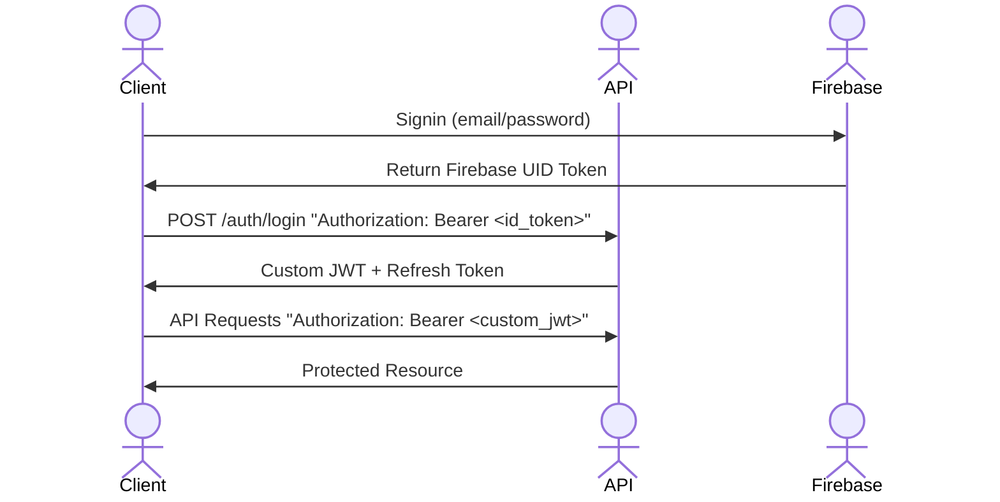

# API Design

## Overview
Establishing rules and patterns that the overall project will adhere to ensuring consistency.

## RESTful Conventions
### Resource Naming
All resources use **plural nouns** in URLs, even for single-item operations.

**Correct:**
- `/users` - Collection of users
- `/users/:id` - Single user
- `/plans` - Collection of plans
- `/plans/:id/attendees` - Nested collection

**Incorrect:**
- `/user` - Don't use singular
- `/getUser/:id` - Don't use verbs in resource names
- `/users/:id/getPlans` - Don't use verbs in paths

### HTTP Verbs
Use the standard HTTP verbs for indicating the action being made:

| Verb | Purpose | Example |
|------|---------|---------|
| `GET` | Retrieve resource(s) | `GET /plans` - List all plans |
| `POST` | Create new resource | `POST /plans` - Create a plan |
| `PATCH` | Partial update | `PATCH /plans/:id` - Update plan fields |
| `PUT` | Full replacement | `PUT /plans/:id` - Replace entire plan |
| `DELETE` | Remove resource | `DELETE /plans/:id` - Delete a plan |

**Best Practices:**
- Use `PATCH` for partial updates
- Use `PUT` only when replacing the entire resource
- `POST` to collections creates new items
- `POST` to a specific resource performs actions (see Custom Actions below)

### URL Structure
**Pattern:** `/{resourece}/{id}/{sub-resource}/{id}`

**Examples**
```http
# Users
POST /users # Create new user
GET /users/:id # Get user profile
PATCH /users/:id # Update part of user profile
DELETE /users/:id # Delete user profile

# Nested Resource (Plan attendees)
GET /plans/:id/attendees # List plan attendees
POST /plans/:id/attendees # Join a plan
DELETE /plans/:id/attendees/:userId # Remove an attendee

# Notifications
GET /users/:id/notifications # Get all notifications for user
PATCH /users/:id/notifications/:notificationId/read # Mark notification as read
```

### Custom Actions
Actions that don't fit the regular CRUD operations. Use `POST` to a descriptive endpoint:
**Pattern** `POST /{resource}/{id}/{action}`

**Examples**
```http
# Plan actions
POST /plans/:id/join # Join a plan
POST /plans/:id/check-in # QR code check in

# User actions
POST /users/:id/block # Block a user
POST /users/:id/follow # Follow a user

# Subscriptions
POST /subscriptions/portal # Get customer portal URL
```

**Rationale:**
- These are **RPC-style** operations that don't map cleanly to resource updates as RPC is more action focused, rather than entity oriented
- Using `POST` makes it clear these are actions, not just data updates
- Action names use verbs (join, leave, block) since they're operations, not resources

### Query Parameters
Use query parameters for filtering, sorting and pagination:

**Filtering**
```http
GET /plans?interests=bouldering,coffee # Names of activities
GET /plans?distance=5&lat=34.05&lng=-118.24 # Location based filtering
GET /plans?startTimeAfter=2024-02-15T00:00:00z # Time based filtering
GET /plans?status=visible # Visibility based filtering
```

**Sorting**
```http
GET /plans?sort=startTime # Default ascending
GET /plans?sort=-startTime # Descending using minus prefix
GET /plans?sort=distance,startTime # Multiple fields
```

**Pagination**
```http
GET /plans?limit=20&cursor=djnASdNJJN # Cursor-based (preference for feeds)
GET /reports?limit=50&offset=100 # Offset based
```

**Search**
```http
GET /plans?q=coffee # Free text search in title/description
```

## Authentication
Using **JSON Web Token (JWT) bearer tokens** to handle API authentication.

### Authentication Flow


**Auth Flow** (The "BFF" Pattern)
1. The user logs in via Google/Email. Firebase returns an ID Token to the frontend.

2. The frontend immediately sends that ID Token to the backend (/auth/login).

3. The backend verifies the Firebase ID Token. If valid, the backend generates two things of its own:

    - Custom JWT (Access Token): Sent in the JSON body (stored in JS Memory).
    - Refresh Token: Sent in a Set-Cookie header with the HttpOnly and Secure flags.

4. Cookies is holding the 7-day key, and JavaScript is holding the 15-minute key.

### Token Types
Different tokens are used for specific purposes, ensuring higher level of security.

**Firebase ID Token**
- When user logs in (via Google, email etc) Firebase returns the ID Token back.
- Client sends to /auth/login with the firebase ID.
- Proves to the backend that the user has successfully authenticated.
- 1 hour life cycle.
- Used to switch out for the Custom JWT.

**Custom JWT**
- Acts as the access token, sent in `Authorization: Bearer <token>` header on every request.
- Returned by the backend once /auth/login has been hit.
- Used for validation on backend requests.
- Expires after 15 minutes for high security resets.
- Once expired, API returns `401 Unauthorized`.
- Stored in memory, rather than localstorage/cookies to ensure no XSS (Cross-site scripting) attacks.
- Refreshed by the /refresh endpoint via the Refresh Token.

**Refresh Token**
- When 15 minute window for Custom JWT has expired, Refresh Token is sent to /refresh to retrieve a fresh Custom JWT.
- Stored as HttpOnly Cookie as critical security as this stops any scripts running and reading the cookie.
- 7 day life as it doesn't keep a user logged in for longer than a week.

### Bearer Tokens
All authentication requests must include the JWT in the `Authorization` header.

```http 
GET /plans Authorization: Bearer eyASDLJNASDNJKD
```

### Token Payload
The JWT contains the following payload claims:

```json
{
  "sub": "usr_123",
  "email": "test@email.com",
  "role": "user",
  "tier": "premium",
  "emailVerified": true,
  "iat": 17092323,
  "exp": 17092343
}
```

- `sub`: User ref (subject)
- `email`: Users email address
- `role`: Role of the user "user | moderator | admin"
- `tier`: Subscription level "free | premium"
- `emailVerified`: If email has been verified
- `iat`: Issued at (Unix timestamp)
- `exp`: Expiration (Unix timestamp)

### Authorization Levels

Different endpoints require different authorization levels:

| Level | Description | Example Endpoints |
|-------|-------------|-------------------|
| **Public** | No authentication required | `GET /plans` (browse), `GET /plans/:id` (view) |
| **Authenticated** | Valid JWT required | `POST /plans` (create), `POST /plans/:id/join` |
| **Email Verified** | JWT + `emailVerified: true` | `POST /plans/:id/messages` (chat) |
| **Host Only** | JWT + user is plan host | `PATCH /plans/:id`, `DELETE /plans/:id` |
| **Premium Only** | JWT + `tier: 'premium'` | `POST /plans` (with `accessLevel: 'premium'`) |
| **Moderator** | JWT + `role: 'moderator'` | `GET /reports`, `PATCH /reports/:id` |
| **Admin** | JWT + `role: 'admin'` | `PATCH /users/:id/ban`, `GET /admin/*` |

### Security Considerations
**Token Storage (Client)**
- Store access token (Custom JWT) in memory (Zustand)
- Store refresh token in HttpOnly cookie
- Never store tokens in plain localStorage due to risk of XSS vulnerability

**Token Rotation**
- Refresh tokens are single-use and each refresh returns a new refresh token
- Old refresh tokens are invalidated immediately after use
- Prevents token replay attacks

**Rate Limiting**
- Login attempts: 5 per IP per 15 minutes
- Refresh token: 10 per user per hour
- Registration: 3 per IP per hour

**Password Requirements**
- Minimum 8 characters
- At least one uppercase
- At least one lowercase
- At least one number
- Hashed with Argon2

## Authorization
Using various authorization patterns to ensure control access to particular resources and actions.

### Role-Based Access Control (RBAC)
Users are assigned a role which has rules associated with them

**Roles**
| Role | Description | System Access |
|------|-------------|---------------|
| `user` | Standard user | Create plans, join plans, send messages, file reports |
| `moderator` | Content moderator | All user permissions + view/resolve reports, hide content, view moderation decisions |
| `admin` | System administrator | All moderator permissions + ban users, manage feature flags, view audit logs |

**Role Hierarchy**
Higher roles inherit all permissions from lower roles.
`admin` > `moderator` > `user`


